# Palo Alto Networks — Career Intelligence & Retention Opportunity Platform

[](https://www.python.org/)
[](https://streamlit.io/)
[](https://scikit-learn.org/)
[](LICENSE)
[]()

> **Proactive Career-Centric Workforce Management vs Reactive Attrition Prediction**  
> An end-to-end Machine Learning and Decision Intelligence platform uncovering promotion velocity gaps, role stagnation patterns, and actionable retention opportunities before voluntary employee turnover occurs.

---

## Strategic Vision & Problem Statement

Traditional HR analytics models focus narrowly on predicting *who is likely to leave*. However, by the time an employee signals high turnover probability, they are often already disengaged, leading to costly counteroffers or sudden departures.

This platform introduces **Career Intelligence as an Unsupervised Retention Strategy**:
- Diagnoses why high performers disengage by uncovering promotion velocity deficits and lateral stagnation.
- Identifies high-value active employees in the **Retention Opportunity Zone** before voluntary departure.
- Delivers prescriptive interventions (Fast-Track Promotion Reviews, Lateral Rotations, Executive Upskilling, Mentorship Realignment).
- Provides an interactive **Career Simulator & What-If Sandbox** for talent leaders and HR Business Partners.

---

## System Architecture

```mermaid
flowchart TD
    A["Raw Workforce Dataset (1,470 Records, 31 Features)"] --> B["Data Loader & Validation (src/data_loader.py)"]
    B --> C["Feature Engineering Engine"]
    
    subgraph Feature_Engineering ["KPI & Career Velocity Formulations"]
        C1["Promotion Gap Ratio"]
        C2["Role Stagnation Index"]
        C3["Training Intensity Score"]
        C4["Manager Stability Indicator"]
        C5["Career Velocity & Comp Ratio"]
        C6["Promotion Gap Risk Score (0-100)"]
        C7["Retention Opportunity Index (ROI)"]
    end
    
    C --> Feature_Engineering
    Feature_Engineering --> D["ML Pipeline (src/ml_pipeline.py)"]
    
    subgraph ML_Modeling ["Unsupervised Learning & Projection"]
        D1["StandardScaler Normalization"]
        D2["K-Means Clustering (K=5)"]
        D3["Hierarchical Clustering Validation"]
        D4["PCA (2D & 3D Projections)"]
        D5["Centroid Archetype Mapper"]
    end
    
    D --> ML_Modeling
    ML_Modeling --> E["Analytics & Prescriptive Engine (src/analytics.py)"]
    
    subgraph UI_Streamlit ["Interactive Web Application (app.py)"]
        F1["Executive Overview Cockpit"]
        F2["Career Path Clustering Dashboard"]
        F3["Promotion Gap Monitor"]
        F4["Retention Opportunity Action Panel"]
        F5["Managerial Impact Matrix"]
        F6["Career Simulator & What-If Lab"]
        F7["Workforce Data Explorer"]
        F8["Research & Policy Brief Viewer"]
    end
    
    E --> UI_Streamlit
```



---

## Mathematical Formulations & KPIs

| Metric | Mathematical Formula | Business Interpretation |
| :--- | :---: | :--- |
| **Promotion Gap Ratio** | $\frac{\text{YearsSinceLastPromotion}}{\text{YearsAtCompany} + 1}$ | Proportion of total company tenure spent without advancement. |
| **Role Stagnation Index** | $\frac{\text{YearsInCurrentRole}}{\text{YearsAtCompany} + 1}$ | Degree of role immobility relative to company tenure. |
| **Training Intensity Score** | $\frac{\text{TrainingTimesLastYear}}{\text{YearsAtCompany} + 1}$ | Learning and upskilling investment rate per tenure year. |
| **Manager Stability Indicator** | $\frac{\text{YearsWithCurrManager}}{\text{YearsInCurrentRole} + 1}$ | Ratio of direct supervisor continuity relative to role tenure. |
| **Promotion Gap Risk Score** | $f(YSLP, RSI, YICR, \text{Satisfaction}) \in [0, 100]$ | Composite continuous index quantifying stagnation severity. |
| **Retention Opportunity Index** | $f(\text{Active}, \text{Performance}, \text{Involvement}, PGRS) \in [0, 100]$ | Algorithmic priority score for proactive talent intervention. |

---

## 5 Workforce Career Archetypes

1. **Fast-Track Performers:** Rapid promotion cycles, high career velocity, low stagnation.
2. **Stable Long-Term Contributors:** Seasoned veterans (20+ yrs tenure) with deep institutional knowledge.
3. **Early-Career Explorers:** New joiners (< 2 yrs tenure) demonstrating high training agility.
4. **Promotion-Stalled Contributors:** Strong performers with >= 3.5 years without title or band progression (primary retention opportunity).
5. **High-Risk Stagnation Profiles:** Prolonged role inertia and stagnant manager dyads requiring immediate lateral rotation.

---

## Local Setup & Quick Start

### 1. Clone the Repository
```bash
git clone https://github.com/your-username/palo-alto-career-intelligence.git
cd palo-alto-career-intelligence
```

### 2. Set Up Virtual Environment (Recommended)
```bash
# Windows
python -m venv venv
venv\Scripts\activate

# macOS / Linux
python3 -m venv venv
source venv/bin/activate
```

### 3. Install Dependencies
```bash
pip install -r requirements.txt
```

### 4. Run Automated Unit Tests
```bash
python -m unittest tests/test_pipeline.py
```

### 5. Launch the Streamlit Web Application
```bash
python -m streamlit run app.py
```
Open **http://localhost:8501** in your browser.

---

## Deployment to Streamlit Community Cloud

Deploying this app live to **Streamlit Community Cloud** takes under 2 minutes:

1. **Push your code to GitHub:**
   ```bash
   git init
   git add .
   git commit -m "feat: complete Career Intelligence ML Platform"
   git branch -M main
   git remote add origin https://github.com/YOUR_GITHUB_USERNAME/YOUR_REPO_NAME.git
   git push -u origin main
   ```
2. Go to **[share.streamlit.io](https://share.streamlit.io)** and log in with your GitHub account.
3. Click **"New app"**.
4. Select your repository, branch (`main`), and set **Main file path** to `app.py`.
5. Click **"Deploy!"**.

---

## Repository Structure

```
├── Palo Alto Networks(1).csv      # Enterprise HR workforce dataset
├── app.py                         # Main Streamlit web application (8 modules)
├── requirements.txt               # Locked Python dependencies
├── RESEARCH_PAPER.md              # Formal academic/industry research paper
├── EXECUTIVE_SUMMARY.md           # C-Suite & government stakeholder briefing
├── README.md                      # Project documentation and deployment guide
├── .streamlit/
│   └── config.toml                # Enterprise slate theme configuration
├── src/
│   ├── __init__.py
│   ├── data_loader.py             # Feature engineering & dataset preparation
│   ├── ml_pipeline.py             # K-Means, Hierarchical, PCA, and simulation
│   ├── analytics.py               # Managerial matrices & KPI aggregations
│   └── ui_components.py           # Custom CSS, metrics cards, Plotly charts
└── tests/
    └── test_pipeline.py           # Automated unit test suite
```

---

## Deliverable Documentation

- **[Research Paper](RESEARCH_PAPER.md)**: Full academic analysis with literature review, mathematical derivations, clustering validation, and empirical findings.
- **[Executive Summary](EXECUTIVE_SUMMARY.md)**: Strategic briefing for C-suite executives and public workforce policy leaders.

---

## License
This project is licensed under the **MIT License**.
