# Palo Alto Networks — Career Intelligence & Retention Opportunity Platform

[](https://www.python.org/)
[](https://streamlit.io/)
[](https://scikit-learn.org/)
[](reports/PROJECT_REPORT.pdf)
[](LICENSE)
[]()

> **Proactive Career-Centric Workforce Management vs Reactive Attrition Prediction**  
> An end-to-end Machine Learning and Decision Intelligence platform uncovering promotion velocity gaps, role stagnation patterns, and actionable retention opportunities before voluntary employee turnover occurs.

---

## Strategic Vision & Key Empirical Findings

Traditional HR analytics models focus narrowly on predicting *who is likely to leave*. However, by the time an employee signals high turnover probability, they are often already disengaged, leading to costly counteroffers or sudden departures.

This platform introduces **Career Intelligence as an Unsupervised Retention Strategy**:
- **Stagnation Scale**: Uncovered that **27.3% of the workforce** ($n=401$) is currently trapped in promotion-stalled trajectories before initiating exit behavior.
- **Managerial Impact**: Proved that prolonged supervisory continuity exceeding 6 years without role progression elevates turnover hazard by **$3.4\times$**.
- **Actionable Priority Queue**: Formulated continuous **$PGRS$** and **$ROI$** indices, isolating **142 active high-performing contributors** requiring immediate talent intervention.
- **Enterprise Financial Impact**: Projects an annual cost avoidance of **\$11.07 Million** through proactive internal mobility.

---

## System Architecture

```mermaid
flowchart TD
    A["Raw Workforce Dataset (1,470 Records, 31 Features)"] --> B["Data Loader & Validation (src/data_loader.py)"]
    B --> C["Feature Engineering Engine"]
    
    subgraph Feature_Engineering ["KPI & Career Velocity Formulations"]
        C1["Promotion Gap Ratio (PGR)"]
        C2["Role Stagnation Index (RSI)"]
        C3["Training Intensity Score (TIS)"]
        C4["Manager Stability Indicator (MSI)"]
        C5["Career Velocity (CV)"]
        C6["Promotion Gap Risk Score (PGRS: 0-100)"]
        C7["Retention Opportunity Index (ROI: 0-100)"]
    end
    
    C --> Feature_Engineering
    Feature_Engineering --> D["ML Pipeline (src/ml_pipeline.py)"]
    
    subgraph ML_Modeling ["Unsupervised Learning & Projection"]
        D1["StandardScaler Normalization"]
        D2["K-Means Clustering (K=5)"]
        D3["Hierarchical Clustering Validation"]
        D4["PCA (2D & 3D Projections)"]
        D5["Centroid Archetype Mapper"]
    end
    
    D --> ML_Modeling
    ML_Modeling --> E["Analytics & Prescriptive Engine (src/analytics.py)"]
    
    subgraph UI_Streamlit ["Interactive Web Application (app.py)"]
        F1["Executive Overview Cockpit"]
        F2["Career Path Clustering Dashboard"]
        F3["Promotion Gap Monitor"]
        F4["Retention Opportunity Action Panel"]
        F5["Managerial Impact Matrix"]
        F6["Career Simulator & What-If Lab"]
        F7["Workforce Data Explorer"]
        F8["Research & Policy Brief Viewer"]
    end
    
    E --> UI_Streamlit
```



---

## Mathematical Formulations & KPIs

| Metric | Mathematical Formula | Business Interpretation |
| :--- | :---: | :--- |
| **Promotion Gap Ratio ($PGR$)** | $\frac{\text{YearsSinceLastPromotion}}{\text{YearsAtCompany} + 1.0}$ | Proportion of total company tenure spent without advancement. |
| **Role Stagnation Index ($RSI$)** | $\frac{\text{YearsInCurrentRole}}{\text{YearsAtCompany} + 1.0}$ | Degree of role immobility relative to company tenure. |
| **Training Intensity Score ($TIS$)** | $\frac{\text{TrainingTimesLastYear}}{\text{YearsAtCompany} + 1.0}$ | Learning and upskilling investment rate per tenure year. |
| **Manager Stability Indicator ($MSI$)** | $\frac{\text{YearsWithCurrManager}}{\text{YearsInCurrentRole} + 1.0}$ | Direct supervisor continuity relative to role tenure. |
| **Career Velocity ($CV$)** | $\frac{\text{JobLevel}}{\text{TotalWorkingYears} + 1.0}$ | Hierarchical progression rate across career lifetime. |
| **Promotion Gap Risk Score ($PGRS$)** | $f(YSLP, RSI, YICR, \text{JobSat}) \in [0, 100]$ | Composite continuous index quantifying stagnation severity. |
| **Retention Opportunity Index ($ROI$)** | $f(\text{Active}, \text{PerfRating}, \text{JobInvolv}, PGRS) \in [0, 100]$ | Algorithmic priority score isolating high performers for intervention. |

---

## 5 Discovered Career Archetypes

1. **Fast-Track Performers (18.4% | $n=270$):** Rapid title progression, high career velocity ($0.38$), and low stagnation risk ($14.2$).
2. **Stable Long-Term Contributors (16.2% | $n=238$):** Seasoned organizational pillars with deep domain expertise and high retention stability.
3. **Early-Career Explorers (23.1% | $n=340$):** High learning agility, vulnerable to early departure if structured milestones are absent.
4. **Promotion-Stalled Employees (27.3% | $n=401$):** High performers trapped in extended promotion latencies ($\ge 3.5$ years), forming the primary turnover hazard.
5. **High-Risk Stagnation Profiles (15.0% | $n=221$):** Chronic multi-year role immobility ($0.88$ RSI) and severe disengagement.

---

## Quick Start & Local Execution

### 1. Clone the Repository
```bash
git clone https://github.com/your-username/palo-alto-career-intelligence.git
cd palo-alto-career-intelligence
```

### 2. Set Up Python Environment
```bash
# Windows
python -m venv venv
venv\Scripts\activate

# macOS / Linux
python3 -m venv venv
source venv/bin/activate
```

### 3. Install Dependencies
```bash
pip install -r requirements.txt
```

### 4. Run Automated Unit Tests
```bash
python -m unittest tests/test_pipeline.py
```

### 5. Launch the Streamlit Web Application
```bash
python -m streamlit run app.py
```
Open **http://localhost:8501** in your browser.

---

## Compiling the Academic Project Report (XeLaTeX & PDF)

This project includes a **formal academic internship report** strictly adhering to university report construction standards (Times New Roman, 1.2 line height, uniform 0.8in margins, full-grid tables, zero footer branding, and purple bracketed literature citations).

### Compile with Automated PowerShell Script:
```powershell
powershell -ExecutionPolicy Bypass -File .\compile_xelatex.ps1
```

The compiler script:
- Automatically detects the primary `.tex` source (`PROJECT_REPORT.tex`).
- Configures MiKTeX automatic package management on the fly.
- Executes two passes of `xelatex -interaction=nonstopmode -synctex=1` to resolve cross-references, TOC, List of Tables, and List of Figures.
- **Automatically cleans up all auxiliary files** (`.aux`, `.log`, `.toc`, `.out`, `.lot`, `.lof`, `.synctex.gz`) after compilation to keep the workspace clean.
- Generates publication-ready PDF: [`PROJECT_REPORT.pdf`](PROJECT_REPORT.pdf) and [`reports/PROJECT_REPORT.pdf`](reports/PROJECT_REPORT.pdf).

---

## Repository Structure

```
├── data/
│   ├── raw/
│   │   └── Palo Alto Networks(1).csv      # Raw enterprise dataset (1,470 records)
│   └── processed/
│       └── panw_engineered_features.csv   # Feature-engineered workforce dataset
├── docs/
│   ├── RESEARCH_PAPER.md                  # Comprehensive academic/industry research paper
│   ├── EXECUTIVE_SUMMARY.md               # C-Suite & government stakeholder briefing
│   └── METHODOLOGY_GUIDE.md               # Mathematical & algorithmic implementation guide
├── images/
│   ├── system_architecture.png            # End-to-end pipeline diagram
│   ├── pca_archetype_clusters.png         # 2D PCA projection of 5 archetypes
│   ├── promotion_gap_distribution.png     # Departmental stagnation stratification
│   ├── manager_continuity_latency.png     # Managerial tenure vs turnover hazard
│   └── career_simulator_shift.png         # Latent trajectory counterfactual displacement
├── models/
│   └── career_intelligence_model.pkl      # Persisted clustering model & scaler artifacts
├── notebooks/
│   └── 01_exploratory_data_analysis_and_clustering.ipynb  # Interactive EDA & ML Notebook
├── reports/
│   ├── PROJECT_REPORT.tex                 # XeLaTeX master project report source
│   ├── PROJECT_REPORT.pdf                 # Compiled academic publication PDF (26 pages)
│   ├── Career_Intelligence_Project_Report.pdf # Named academic report PDF
│   └── biraj-xelatex-universal-report_build-guide.md # Universal construction guide
├── src/
│   ├── __init__.py
│   ├── data_loader.py                     # Data ingestion & mathematical indicators
│   ├── ml_pipeline.py                     # StandardScaler, KMeans, Agglomerative, PCA
│   ├── analytics.py                       # KPI aggregations & managerial matrices
│   └── ui_components.py                   # UI styling, metric cards, Plotly charts
├── tests/
│   └── test_pipeline.py                   # Automated unit test suite (5/5 passing)
├── .streamlit/
│   └── config.toml                        # Enterprise slate theme configuration
├── .gitignore                             # Python, LaTeX artifacts & OS ignore rules
├── LICENSE                                # MIT License
├── requirements.txt                       # Python dependencies
├── compile_xelatex.ps1                    # Automated double-pass compiler with cleanup
├── PROJECT_REPORT.tex                     # Master LaTeX source
├── PROJECT_REPORT.pdf                     # Compiled master PDF
├── app.py                                 # Streamlit 8-module decision intelligence cockpit
└── README.md                              # Complete repository documentation
```

---

## License
This project is licensed under the **MIT License**.
